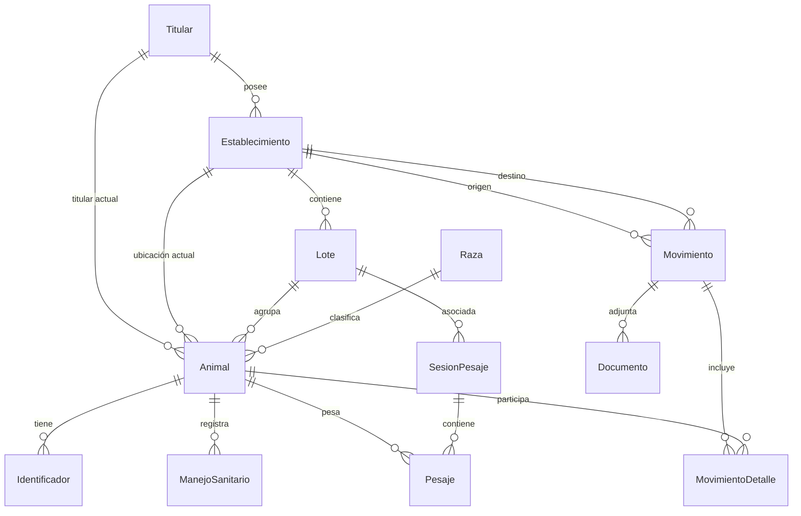

# Arquitectura Técnica — Mi Ganado

**Última actualización:** 2026-02-08

## Diagrama General


## Stack

| Capa | Tecnología | Versión |
|------|-----------|---------|
| Framework | Next.js (App Router) | 16.1.6 |
| UI | React + TailwindCSS 4 | 19.2.3 |
| Componentes | shadcn/ui + Radix UI | latest |
| Estado | Zustand (auth, offline) | 5.0 |
| Data fetching | TanStack Query | 5.x |
| Formularios | React Hook Form + Zod | 7.x + 4.x |
| Backend | NestJS + Prisma | — |
| DB | PostgreSQL | — |
| Deploy FE | Vercel | — |
| Deploy BE | Railway | — |

## Modelo de Datos (Entidades Principales)



### Entidades

| Entidad | Descripción | Enums clave |
|---------|-------------|-------------|
| **Titular** | Dueño del ganado (persona/empresa) | TipoTitular, EstadoGeneral |
| **Establecimiento** | Predio ganadero (propio/socio/externo) | TipoEstablecimiento |
| **Animal** | Bovino individual con trazabilidad SIPEC | Especie, Sexo, CategoriaAnimal, EstadoAnimal |
| **Identificador** | DIIO, RFID, Chip, Bolus por animal | TipoIdentificador |
| **Raza** | Catálogo de razas por especie | Especie |
| **Lote** | Agrupación de animales en un establecimiento | EstadoGeneral |
| **SesionPesaje** | Sesión de pesaje (equipo, operador, fecha) | — |
| **Pesaje** | Peso individual de un animal | OrigenDato (XR5000/MANUAL) |
| **Movimiento** | Traslado, venta, compra, muerte, ajuste | TipoMovimiento, EstadoMovimiento |
| **MovimientoDetalle** | Animal incluido en un movimiento | — |
| **Documento** | Guía de despacho, factura, formulario | TipoDocumento |
| **ManejoSanitario** | Registro sanitario por animal | — |

## Flujo de Autenticación

1. Login via `POST /auth/login` → recibe `access_token` (JWT)
2. Token se almacena en `localStorage`
3. `ApiClient` adjunta token en header `Authorization: Bearer {token}`
4. `AuthGuard` protege rutas `/dashboard/*`
5. `useAuthStore` (Zustand + persist) mantiene estado de sesión

## Flujo de Datos (Frontend)

```
Page → Service (lib/api/{modulo}.ts) → ApiClient (lib/api/client.ts) → Backend REST API
                                              ↓
                                     Cache (lib/api/cache.ts) — TTL 5 min
```

- **TanStack Query** maneja cache de servidor, refetch, y estados de loading/error
- **Cache manual** (`cache.ts`) previene throttling en endpoints frecuentes (titulares)
- **Zustand** solo para estado local persistente (auth, offline queue)

## Decisiones Técnicas

- **App Router** (no Pages Router) — layouts anidados, server components donde aplique
- **PWA con Service Worker** — registro en `layout.tsx`, manifest en `public/`
- **API Key + JWT** — doble capa de autenticación (API key para el app, JWT para el usuario)
- **Singleton ApiClient** — una instancia exportada, base URL configurable via env
- **shadcn/ui** — componentes copiados a `src/components/ui/`, no como dependencia
