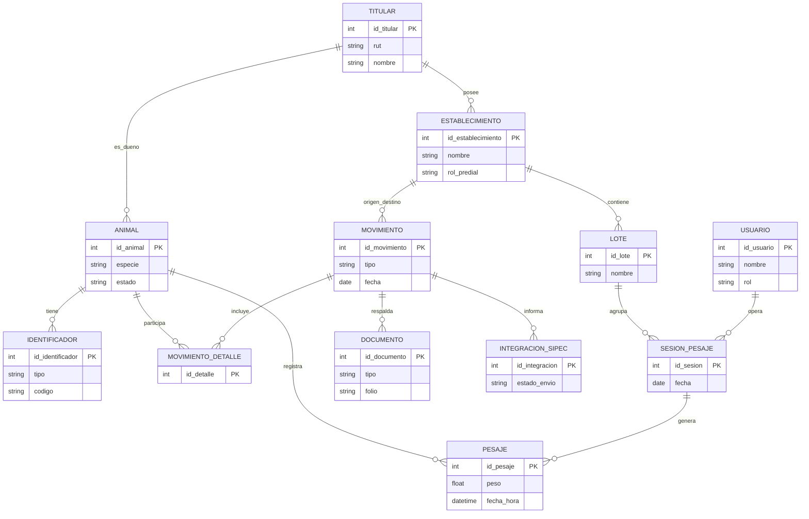

# Scoping del Proyecto – Sistema de Gestión Ganadera Digital - Mi Ganado

## 1. Objetivo del Proyecto

Diseñar y desarrollar una plataforma digital (PWA + Backend) que permita al **titular de establecimiento ganadero** gestionar de forma centralizada, trazable y eficiente la información de su ganado, integrando datos operativos de terreno (RFID, pesaje, lotes, movimientos) y facilitando el cumplimiento y preparación de información para **SIPEC/SAG**.

El sistema actúa como **capa operativa**, no como reemplazo de SIPEC.

---

## 2. Alcance Funcional (IN SCOPE)

### 2.1 Gestión de Ganado

* Registro de animales
* Soporte de **múltiples identificadores por animal**:

  * DIIO visual
  * RFID / chip
* Cambio, baja e historial de identificadores
* Estados del animal (activo, vendido, muerto, traslado)

---

### 2.2 Gestión de Establecimientos y Titulares

* Registro de titulares
* Registro de establecimientos (propios, socios, externos)
* Asociación animal ↔ establecimiento actual
* Historial de ubicación

---

### 2.3 Lotes Operativos

* Creación y administración de lotes
* Asignación lógica de animales a lotes
* Uso del lote como unidad de trabajo (pesaje, traslado, venta)

---

### 2.4 Pesaje y Captura de Datos de Terreno

* Importación de sesiones de pesaje desde XR5000 (CSV/TXT)
* Asociación automática RFID → animal
* Registro de sesiones de pesaje
* Validación de datos (duplicados, pesos fuera de rango)
* Historial de pesajes por animal
* Enfoque **offline-first**

---

### 2.5 Movimientos de Ganado

* Registro de movimientos:

  * Traslado
  * Venta
  * Compra
  * Muerte
* Asociación de animales a cada movimiento
* Origen y destino (titular / establecimiento)
* Estados del movimiento (borrador, confirmado, informado)

---

### 2.6 Gestión Documental

* Asociación de documentos a movimientos:

  * Guía de despacho
  * Factura
  * Formulario de entrega
* Registro de folio, fecha y respaldo digital

---

### 2.7 Reportes y Control

* Stock actual por establecimiento
* Historial por animal
* Resumen por lote
* Pesos promedio y evolución
* Movimientos por período

---

### 2.8 Usuarios y Roles

* Gestión de usuarios
* Roles:

  * Administrador
  * Operador
  * Solo lectura

---

## 3. Alcance Técnico (IN SCOPE)

### 3.1 Frontend

* PWA desarrollada en **Next.js**
* Diseño responsive (móvil / tablet / escritorio)
* Soporte offline

### 3.2 Backend

* Backend en **NestJS**
* API REST
* Autenticación y autorización
* Persistencia en base de datos relacional

---

## 4. Fuera de Alcance (OUT OF SCOPE – Fase Inicial)

* Integración directa vía API con SIPEC (no existe API pública)
* Integración directa en tiempo real con stick reader
* Gestión sanitaria (vacunas, tratamientos)
* Gestión contable avanzada
* Facturación electrónica
* Automatización de envíos oficiales a SAG
* Multi-especie (solo bovinos en fase inicial)

---

## 5. Fases del Proyecto

### Fase 1 – MVP

* Gestión de animales e identificadores
* Establecimientos y lotes
* Importación XR5000
* Pesajes
* Movimientos básicos
* Reportes esenciales

### Fase 2 – Optimización

* Mejor UX en terreno
* Validaciones avanzadas
* Dashboards
* Preparación de datos para SIPEC

### Fase 3 – Evolución

* Integraciones externas
* Módulo sanitario
* Multi-especie
* Analítica avanzada

---

## 6. Supuestos y Restricciones

* Trabajo frecuente sin conectividad
* Uso de hardware existente del cliente
* Dependencia de formatos de exportación XR5000
* Cumplimiento normativo chileno

---

## 7. Beneficios Esperados

* Reducción de errores manuales
* Mayor control y visibilidad del ganado
* Mejor trazabilidad histórica
* Ahorro de tiempo operativo
* Base sólida para crecimiento futuro

---

# Modelo ERD – Sistema de Gestión Ganadera

Este modelo representa la estructura de datos recomendada para el sistema de **Gestión Ganadera Digital**, considerando:

* Identificación múltiple por animal (DIIO visual, RFID, chip, bolus)
* Pesaje con XR5000
* Movimientos entre campos y titulares
* Documentación legal (guías, facturas)
* Compatibilidad operativa con SIPEC

---

## 1. Titular

**Representa al dueño legal del ganado o del establecimiento**

* id_titular (PK)
* rut
* nombre_razon_social
* tipo (persona_natural / empresa)
* contacto
* estado

Relaciones:

* Titular 1 ── * Establecimiento
* Titular 1 ── * Animal

---

## 2. Establecimiento

**Campos o predios**

* id_establecimiento (PK)
* titular_id (FK)
* nombre
* rol_predial
* ubicación
* tipo (propio / socio / externo)
* estado

Relaciones:

* Establecimiento 1 ── * Lote
* Establecimiento 1 ── * Movimiento (origen / destino)

---

## 3. Animal

**Entidad central (no depende del identificador)**

* id_animal (PK)
* especie (bovino)
* sexo
* fecha_nacimiento (nullable)
* titular_actual_id (FK)
* establecimiento_actual_id (FK)
* estado (activo / vendido / muerto)
* fecha_alta
* fecha_baja (nullable)

Relaciones:

* Animal 1 ── * Identificador
* Animal 1 ── * Pesaje
* Animal 1 ── * MovimientoDetalle

---

## 4. Identificador

**Permite múltiples identificaciones por animal**

* id_identificador (PK)
* animal_id (FK)
* tipo (DIIO_VISUAL / RFID / CHIP / BOLUS)
* codigo
* activo (boolean)
* fecha_asignacion
* fecha_baja (nullable)
* motivo_baja (nullable)

Restricción:

* Un DIIO_VISUAL activo por animal

---

## 5. Lote

**Grupo operativo de animales**

* id_lote (PK)
* establecimiento_id (FK)
* nombre
* descripción
* fecha_creacion
* estado

Relaciones:

* Lote 1 ── * Animal (asignación lógica)
* Lote 1 ── * SesionPesaje

---

## 6. SesionPesaje

**Captura una jornada o evento de pesaje**

* id_sesion (PK)
* lote_id (FK)
* fecha
* equipo (XR5000)
* operador
* observaciones

Relaciones:

* SesionPesaje 1 ── * Pesaje

---

## 7. Pesaje

**Registro individual por animal**

* id_pesaje (PK)
* sesion_id (FK)
* animal_id (FK)
* peso
* fecha_hora
* origen_dato (XR5000 / manual)
* valido (boolean)

---

## 8. Movimiento

**Evento legal u operativo**

* id_movimiento (PK)
* tipo (traslado / venta / compra / muerte / ajuste)
* fecha
* establecimiento_origen_id (FK)
* establecimiento_destino_id (FK, nullable)
* titular_origen_id (FK)
* titular_destino_id (FK, nullable)
* estado (borrador / confirmado / informado)

Relaciones:

* Movimiento 1 ── * MovimientoDetalle
* Movimiento 1 ── * Documento

---

## 9. MovimientoDetalle

**Animales involucrados en el movimiento**

* id_detalle (PK)
* movimiento_id (FK)
* animal_id (FK)

---

## 10. Documento

**Respaldo legal del movimiento**

* id_documento (PK)
* movimiento_id (FK)
* tipo (guia_despacho / factura / formulario_entrega)
* folio
* fecha
* archivo_url (nullable)

---

## 11. Usuario

**Usuarios del sistema**

* id_usuario (PK)
* nombre
* rol (admin / operador / lectura)
* email
* estado

Relaciones:

* Usuario 1 ── * SesionPesaje

---

## 12. IntegracionSIPEC (opcional / futura)

**Estado de comunicación con SIPEC**

* id_integracion (PK)
* movimiento_id (FK)
* estado_envio
* fecha_envio
* respuesta

---

## Principios clave del modelo

* El **Animal no depende del DIIO**
* Todo evento es **histórico e inmutable**
* Los identificadores son reemplazables
* Los movimientos concentran la lógica legal
* SIPEC es un estado, no la fuente primaria

Este modelo está pensado para:

* Trabajo offline-first
* Importación desde XR5000
* Escalabilidad futura (sanidad, costos, multi-especie)

---

## Diagrama ERD (vista conceptual)

-- =============================================
-- Schema: Gestión Ganadera Digital
-- Base de datos: PostgreSQL
-- Dump SOLO estructura (-s)
-- =============================================

-- =============================
-- TITULAR
-- =============================
CREATE TABLE titular (
    id_titular SERIAL PRIMARY KEY,
    rut VARCHAR(20) NOT NULL UNIQUE,
    nombre_razon_social VARCHAR(255) NOT NULL,
    tipo VARCHAR(30) NOT NULL, -- persona_natural | empresa
    contacto VARCHAR(255),
    estado VARCHAR(20) DEFAULT 'activo'
);

-- =============================
-- ESTABLECIMIENTO
-- =============================
CREATE TABLE establecimiento (
    id_establecimiento SERIAL PRIMARY KEY,
    titular_id INT NOT NULL REFERENCES titular(id_titular),
    nombre VARCHAR(255) NOT NULL,
    rol_predial VARCHAR(50),
    ubicacion TEXT,
    tipo VARCHAR(30), -- propio | socio | externo
    estado VARCHAR(20) DEFAULT 'activo'
);

-- =============================
-- ANIMAL
-- =============================
CREATE TABLE animal (
    id_animal SERIAL PRIMARY KEY,
    especie VARCHAR(30) DEFAULT 'bovino',
    sexo VARCHAR(10),
    fecha_nacimiento DATE,
    titular_actual_id INT REFERENCES titular(id_titular),
    establecimiento_actual_id INT REFERENCES establecimiento(id_establecimiento),
    estado VARCHAR(20) DEFAULT 'activo',
    fecha_alta TIMESTAMP DEFAULT CURRENT_TIMESTAMP,
    fecha_baja TIMESTAMP
);

-- =============================
-- IDENTIFICADOR
-- =============================
CREATE TABLE identificador (
    id_identificador SERIAL PRIMARY KEY,
    animal_id INT NOT NULL REFERENCES animal(id_animal) ON DELETE CASCADE,
    tipo VARCHAR(30) NOT NULL, -- DIIO_VISUAL | RFID | CHIP | BOLUS
    codigo VARCHAR(100) NOT NULL,
    activo BOOLEAN DEFAULT TRUE,
    fecha_asignacion DATE NOT NULL,
    fecha_baja DATE,
    motivo_baja TEXT
);

CREATE UNIQUE INDEX ux_identificador_codigo
ON identificador (codigo);

-- =============================
-- LOTE
-- =============================
CREATE TABLE lote (
    id_lote SERIAL PRIMARY KEY,
    establecimiento_id INT REFERENCES establecimiento(id_establecimiento),
    nombre VARCHAR(255) NOT NULL,
    descripcion TEXT,
    fecha_creacion TIMESTAMP DEFAULT CURRENT_TIMESTAMP,
    estado VARCHAR(20) DEFAULT 'activo'
);

-- =============================
-- SESION PESAJE
-- =============================
CREATE TABLE sesion_pesaje (
    id_sesion SERIAL PRIMARY KEY,
    lote_id INT REFERENCES lote(id_lote),
    fecha DATE NOT NULL,
    equipo VARCHAR(100), -- XR5000
    operador VARCHAR(255),
    observaciones TEXT
);

-- =============================
-- PESAJE
-- =============================
CREATE TABLE pesaje (
    id_pesaje SERIAL PRIMARY KEY,
    sesion_id INT REFERENCES sesion_pesaje(id_sesion) ON DELETE CASCADE,
    animal_id INT REFERENCES animal(id_animal),
    peso NUMERIC(6,2) NOT NULL,
    fecha_hora TIMESTAMP NOT NULL,
    origen_dato VARCHAR(30), -- XR5000 | manual
    valido BOOLEAN DEFAULT TRUE
);

-- =============================
-- MOVIMIENTO
-- =============================
CREATE TABLE movimiento (
    id_movimiento SERIAL PRIMARY KEY,
    tipo VARCHAR(30) NOT NULL, -- traslado | venta | compra | muerte | ajuste
    fecha DATE NOT NULL,
    establecimiento_origen_id INT REFERENCES establecimiento(id_establecimiento),
    establecimiento_destino_id INT REFERENCES establecimiento(id_establecimiento),
    titular_origen_id INT REFERENCES titular(id_titular),
    titular_destino_id INT REFERENCES titular(id_titular),
    estado VARCHAR(30) DEFAULT 'borrador'
);

-- =============================
-- MOVIMIENTO DETALLE
-- =============================
CREATE TABLE movimiento_detalle (
    id_detalle SERIAL PRIMARY KEY,
    movimiento_id INT NOT NULL REFERENCES movimiento(id_movimiento) ON DELETE CASCADE,
    animal_id INT NOT NULL REFERENCES animal(id_animal)
);

-- =============================
-- DOCUMENTO
-- =============================
CREATE TABLE documento (
    id_documento SERIAL PRIMARY KEY,
    movimiento_id INT REFERENCES movimiento(id_movimiento) ON DELETE CASCADE,
    tipo VARCHAR(30), -- guia_despacho | factura | formulario_entrega
    folio VARCHAR(100),
    fecha DATE,
    archivo_url TEXT
);

-- =============================
-- USUARIO
-- =============================
CREATE TABLE usuario (
    id_usuario SERIAL PRIMARY KEY,
    nombre VARCHAR(255) NOT NULL,
    email VARCHAR(255) UNIQUE,
    rol VARCHAR(30), -- admin | operador | lectura
    estado VARCHAR(20) DEFAULT 'activo'
);

-- =============================
-- INTEGRACION SIPEC (FUTURO)
-- =============================
CREATE TABLE integracion_sipec (
    id_integracion SERIAL PRIMARY KEY,
    movimiento_id INT REFERENCES movimiento(id_movimiento) ON DELETE CASCADE,
    estado_envio VARCHAR(30),
    fecha_envio TIMESTAMP,
    respuesta TEXT
);

-- =============================================
-- FIN DEL DUMP DE ESTRUCTURA
-- =============================================
