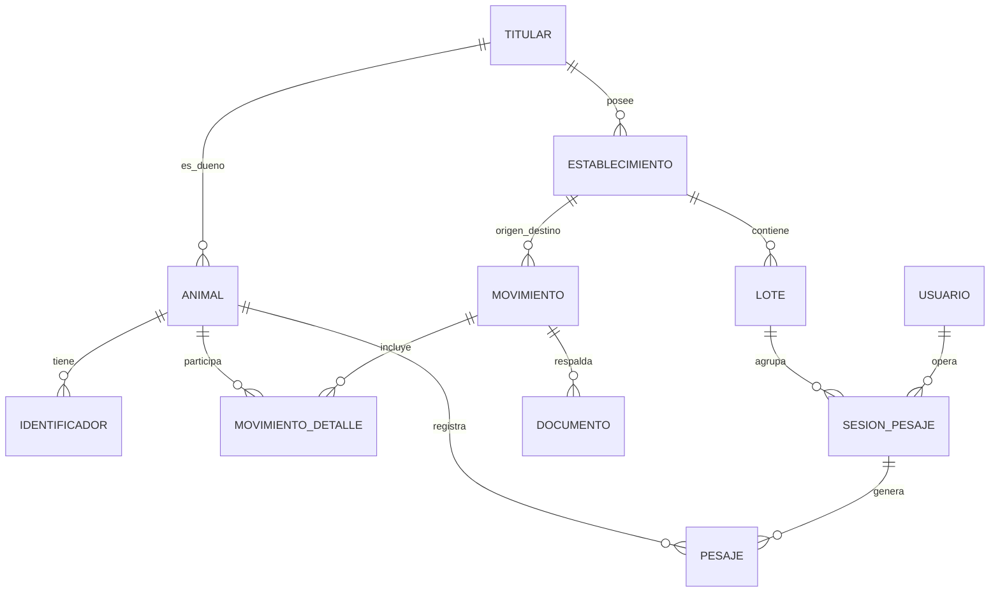

# Documento Oficial del Proyecto

## Sistema de Gestión Ganadera Digital – Mi Ganado

**Versión:** 1.0  
**Fecha:** 29 de enero de 2026  
**Estado:** En desarrollo

---

## Índice

1. [Resumen Ejecutivo](#1-resumen-ejecutivo)
2. [Alcance Funcional Detallado](#2-alcance-funcional-detallado)
3. [Alcance Técnico](#3-alcance-técnico)
4. [Fuera de Alcance Inicial](#4-fuera-de-alcance-inicial)
5. [Plan de Fases](#5-plan-de-fases)
6. [Supuestos y Restricciones](#6-supuestos-y-restricciones)
7. [Beneficios Esperados](#7-beneficios-esperados)
8. [Diseño de Datos / ERD](#8-diseño-de-datos--erd)
9. [Lineamientos para la Implementación](#9-lineamientos-para-la-implementación)
10. [System Design y Guía de Estilos](#10-system-design-y-guía-de-estilos)
11. [Próximos Pasos Recomendados](#11-próximos-pasos-recomendados)

---

## 1. Resumen Ejecutivo

### 1.1 Propósito

**Mi Ganado** es una plataforma digital diseñada para que titulares de establecimientos ganaderos gestionen de forma centralizada, trazable y eficiente la información de su ganado. El sistema integra datos operativos de terreno (RFID, pesaje, lotes, movimientos) y facilita el cumplimiento y preparación de información para **SIPEC/SAG**.

### 1.2 Contexto

El sector ganadero chileno enfrenta desafíos de trazabilidad, registro manual propenso a errores y dificultades para cumplir con los requerimientos normativos del SAG. Los productores trabajan frecuentemente en zonas sin conectividad, utilizando equipos de pesaje como el **XR5000** que generan datos que deben integrarse manualmente a sus registros.

### 1.3 Objetivos Clave

| Objetivo | Descripción |
|----------|-------------|
| **Centralización** | Unificar toda la información del ganado en una sola plataforma |
| **Trazabilidad** | Mantener historial completo de cada animal (identificadores, pesajes, movimientos) |
| **Operatividad offline** | Permitir trabajo en terreno sin conectividad |
| **Cumplimiento normativo** | Facilitar la preparación de datos para SIPEC/SAG |
| **Eficiencia operativa** | Reducir errores manuales y tiempo de gestión |

### 1.4 Posicionamiento

El sistema actúa como **capa operativa**, no como reemplazo de SIPEC. Complementa los sistemas oficiales proporcionando herramientas de gestión diaria que luego alimentan los reportes regulatorios.

---

## 2. Alcance Funcional Detallado

### 2.1 Gestión de Ganado

**Objetivo:** Registro y seguimiento del ciclo de vida de cada animal.

| Funcionalidad | Descripción |
|---------------|-------------|
| **Registro de animales** | Alta de nuevos animales con datos básicos (especie, sexo, fecha nacimiento) |
| **Múltiples identificadores** | Soporte para DIIO visual, RFID, chip y bolus por animal |
| **Cambio de identificadores** | Historial de cambios, bajas y motivos |
| **Estados del animal** | Activo, vendido, muerto, en traslado |

**Validaciones:**
- Un solo DIIO visual activo por animal
- Códigos de identificador únicos en el sistema
- Fecha de baja posterior a fecha de alta

---

### 2.2 Gestión de Establecimientos y Titulares

**Objetivo:** Administrar la estructura organizacional del negocio ganadero.

| Entidad | Atributos principales |
|---------|----------------------|
| **Titular** | RUT, razón social, tipo (persona natural/empresa), contacto, estado |
| **Establecimiento** | Nombre, rol predial, ubicación, tipo (propio/socio/externo), estado |

**Relaciones:**
- Un titular puede tener múltiples establecimientos
- Un animal pertenece a un titular y está ubicado en un establecimiento
- Se mantiene historial de ubicación de cada animal

---

### 2.3 Lotes Operativos

**Objetivo:** Agrupar animales para operaciones masivas.

| Funcionalidad | Descripción |
|---------------|-------------|
| **Creación de lotes** | Nombre, descripción, establecimiento asociado |
| **Asignación de animales** | Asignación lógica (un animal puede pertenecer a un lote) |
| **Operaciones por lote** | Pesaje masivo, traslado grupal, venta por lote |

**Estados del lote:** Activo, cerrado, archivado

---

### 2.4 Pesaje y Captura de Datos de Terreno

**Objetivo:** Integrar datos de equipos de pesaje y mantener historial de pesos.

| Funcionalidad | Descripción |
|---------------|-------------|
| **Importación XR5000** | Lectura de archivos CSV/TXT exportados del equipo |
| **Sesiones de pesaje** | Agrupación de pesajes por fecha, lote y operador |
| **Asociación automática** | Vinculación RFID → animal mediante identificadores registrados |
| **Validación de datos** | Detección de duplicados, pesos fuera de rango |
| **Historial por animal** | Evolución de peso a lo largo del tiempo |

**Enfoque offline-first:**
- Captura de datos sin conexión
- Sincronización posterior con el backend
- Resolución de conflictos

---

### 2.5 Movimientos de Ganado

**Objetivo:** Registrar todos los eventos que afectan la ubicación o propiedad del ganado.

| Tipo de movimiento | Descripción |
|--------------------|-------------|
| **Traslado** | Cambio de establecimiento (mismo titular) |
| **Venta** | Transferencia a otro titular |
| **Compra** | Ingreso desde otro titular |
| **Muerte** | Baja definitiva del animal |
| **Ajuste** | Correcciones administrativas |

**Estados del movimiento:**
1. **Borrador** – En preparación, editable
2. **Confirmado** – Ejecutado, no editable
3. **Informado** – Reportado a SIPEC (futuro)

**Datos asociados:**
- Establecimiento/titular de origen
- Establecimiento/titular de destino
- Lista de animales involucrados
- Fecha del movimiento

---

### 2.6 Gestión Documental

**Objetivo:** Asociar respaldos legales a los movimientos.

| Tipo de documento | Uso |
|-------------------|-----|
| **Guía de despacho** | Traslados y ventas |
| **Factura** | Ventas y compras |
| **Formulario de entrega** | Recepciones |

**Atributos:** Folio, fecha, archivo digital (URL)

---

### 2.7 Reportes y Control

**Objetivo:** Proveer visibilidad y análisis del negocio ganadero.

| Reporte | Descripción |
|---------|-------------|
| **Stock actual** | Cantidad de animales por establecimiento y estado |
| **Historial por animal** | Timeline completo de eventos de un animal |
| **Resumen por lote** | Estadísticas de animales en cada lote |
| **Pesos promedio** | Evolución de peso por lote/establecimiento |
| **Movimientos por período** | Listado de movimientos filtrado por fechas |

---

### 2.8 Usuarios y Roles

**Objetivo:** Controlar el acceso y permisos en el sistema.

| Rol | Permisos |
|-----|----------|
| **Administrador** | Acceso total, gestión de usuarios, configuración |
| **Operador** | CRUD de animales, pesajes, movimientos |
| **Solo lectura** | Consulta de información y reportes |

---

## 3. Alcance Técnico

### 3.1 Arquitectura General

```
┌─────────────────────────────────────────────────────────────────┐
│                         FRONTEND                                 │
│                    PWA en Next.js                                │
│         (mi-ganado: /Users/ja/Documents/GitHub/mi-ganado)        │
│                                                                  │
│  ┌──────────────┐  ┌──────────────┐  ┌──────────────┐           │
│  │   Offline    │  │   Service    │  │   IndexedDB  │           │
│  │    Cache     │  │   Workers    │  │   Storage    │           │
│  └──────────────┘  └──────────────┘  └──────────────┘           │
└─────────────────────────────────────────────────────────────────┘
                              │
                              │ API REST (HTTPS)
                              ▼
┌─────────────────────────────────────────────────────────────────┐
│                         BACKEND                                  │
│                    NestJS (backend-agente)                       │
│     (/Users/ja/Documents/GitHub/backend-agente)                  │
│                                                                  │
│  ┌──────────────┐  ┌──────────────┐  ┌──────────────┐           │
│  │     Auth     │  │    Users     │  │   Payments   │  CORE     │
│  │   (JWT+RBAC) │  │   Profiles   │  │   (futuro)   │           │
│  └──────────────┘  └──────────────┘  └──────────────┘           │
│                                                                  │
│  ┌──────────────────────────────────────────────────┐           │
│  │              MÓDULO MI GANADO (NUEVO)             │           │
│  │  ┌────────┐ ┌────────┐ ┌────────┐ ┌────────┐     │           │
│  │  │Animales│ │ Lotes  │ │Pesajes │ │Movim.  │     │           │
│  │  └────────┘ └────────┘ └────────┘ └────────┘     │           │
│  └──────────────────────────────────────────────────┘           │
└─────────────────────────────────────────────────────────────────┘
                              │
                              │ Prisma ORM
                              ▼
┌─────────────────────────────────────────────────────────────────┐
│                      BASE DE DATOS                               │
│                   PostgreSQL (Supabase)                          │
└─────────────────────────────────────────────────────────────────┘
```

### 3.2 Frontend – PWA en Next.js

| Aspecto | Especificación |
|---------|----------------|
| **Framework** | Next.js 14+ (App Router) |
| **Tipo** | Progressive Web App (PWA) |
| **Diseño** | Responsive (móvil, tablet, escritorio) |
| **Offline** | Service Workers + IndexedDB |
| **UI** | TailwindCSS + shadcn/ui |
| **Estado** | React Query / Zustand |

**Responsabilidades del frontend:**
- Interfaz de usuario para todas las operaciones
- Captura de datos en terreno (offline-first)
- Importación y parseo de archivos XR5000
- Almacenamiento local de datos pendientes
- Sincronización con backend cuando hay conexión

### 3.3 Backend – NestJS (backend-agente)

El proyecto **Mi Ganado** utilizará el backend existente `backend-agente`, que ya provee:

| Componente Core | Estado | Uso en Mi Ganado |
|-----------------|--------|------------------|
| **Autenticación JWT** | ✅ Listo | Login, tokens, sesiones |
| **RBAC** | ✅ Listo | Roles admin/operador/lectura |
| **Gestión de usuarios** | ✅ Listo | Perfiles de usuarios |
| **Prisma ORM** | ✅ Listo | Acceso a base de datos |
| **Swagger** | ✅ Listo | Documentación de API |
| **Health checks** | ✅ Listo | Monitoreo |

**Nuevo módulo a desarrollar en backend-agente:**

```
src/
├── ganado/                    # NUEVO MÓDULO
│   ├── titulares/
│   │   ├── titulares.controller.ts
│   │   ├── titulares.service.ts
│   │   ├── titulares.module.ts
│   │   └── dto/
│   ├── establecimientos/
│   │   ├── establecimientos.controller.ts
│   │   ├── establecimientos.service.ts
│   │   ├── establecimientos.module.ts
│   │   └── dto/
│   ├── animales/
│   │   ├── animales.controller.ts
│   │   ├── animales.service.ts
│   │   ├── animales.module.ts
│   │   └── dto/
│   ├── identificadores/
│   │   └── ...
│   ├── lotes/
│   │   └── ...
│   ├── pesajes/
│   │   └── ...
│   ├── movimientos/
│   │   └── ...
│   ├── documentos/
│   │   └── ...
│   └── ganado.module.ts       # Módulo principal
```

### 3.4 Base de Datos

| Aspecto | Especificación |
|---------|----------------|
| **Motor** | PostgreSQL 15+ |
| **Hosting** | Supabase (con pooling) |
| **ORM** | Prisma 6.x |
| **Migraciones** | Prisma Migrate |

### 3.5 Comunicación Frontend ↔ Backend

| Aspecto | Especificación |
|---------|----------------|
| **Protocolo** | HTTPS |
| **Formato** | JSON |
| **Autenticación** | Bearer Token (JWT) |
| **Versionado** | `/api/v1/ganado/*` |

**Endpoints principales:**

```
# Titulares
GET    /api/v1/ganado/titulares
POST   /api/v1/ganado/titulares
GET    /api/v1/ganado/titulares/:id
PATCH  /api/v1/ganado/titulares/:id

# Establecimientos
GET    /api/v1/ganado/establecimientos
POST   /api/v1/ganado/establecimientos
GET    /api/v1/ganado/establecimientos/:id

# Animales
GET    /api/v1/ganado/animales
POST   /api/v1/ganado/animales
GET    /api/v1/ganado/animales/:id
PATCH  /api/v1/ganado/animales/:id
GET    /api/v1/ganado/animales/:id/historial

# Identificadores
POST   /api/v1/ganado/animales/:id/identificadores
PATCH  /api/v1/ganado/identificadores/:id/baja

# Lotes
GET    /api/v1/ganado/lotes
POST   /api/v1/ganado/lotes
POST   /api/v1/ganado/lotes/:id/animales

# Pesajes
POST   /api/v1/ganado/sesiones-pesaje
POST   /api/v1/ganado/sesiones-pesaje/:id/pesajes
POST   /api/v1/ganado/sesiones-pesaje/importar-xr5000

# Movimientos
GET    /api/v1/ganado/movimientos
POST   /api/v1/ganado/movimientos
PATCH  /api/v1/ganado/movimientos/:id/confirmar
POST   /api/v1/ganado/movimientos/:id/documentos

# Reportes
GET    /api/v1/ganado/reportes/stock
GET    /api/v1/ganado/reportes/movimientos
```

---

## 4. Fuera de Alcance Inicial

Los siguientes ítems **NO** están incluidos en la fase inicial del proyecto:

| Ítem | Motivo de exclusión |
|------|---------------------|
| **Integración directa con SIPEC** | No existe API pública disponible |
| **Conexión en tiempo real con stick reader** | Complejidad técnica, se usa importación de archivos |
| **Gestión sanitaria** | Vacunas, tratamientos – fase posterior |
| **Contabilidad avanzada** | Costos, márgenes – fuera del alcance operativo |
| **Facturación electrónica** | Integración con SII – fase posterior |
| **Automatización de envíos a SAG** | Depende de APIs no disponibles |
| **Multi-especie** | Solo bovinos en fase inicial |

---

## 5. Plan de Fases

### Fase 1 – MVP (3-4 meses)

**Objetivo:** Sistema funcional con operaciones básicas.

| Entregable | Descripción |
|------------|-------------|
| Gestión de animales | CRUD completo con identificadores |
| Establecimientos y lotes | Estructura organizacional |
| Importación XR5000 | Parser de archivos CSV/TXT |
| Pesajes | Registro y asociación a animales |
| Movimientos básicos | Traslado, venta, compra, muerte |
| Reportes esenciales | Stock, historial por animal |
| PWA básica | Interfaz responsive con soporte offline |

**Criterios de éxito:**
- Usuario puede registrar animales y pesajes
- Datos se sincronizan correctamente
- Funciona sin conexión para operaciones básicas

---

### Fase 2 – Optimización (2-3 meses)

**Objetivo:** Mejorar experiencia de usuario y robustez.

| Entregable | Descripción |
|------------|-------------|
| UX en terreno | Flujos optimizados para uso móvil |
| Validaciones avanzadas | Reglas de negocio complejas |
| Dashboards | Visualizaciones de KPIs |
| Preparación SIPEC | Exportación de datos en formatos compatibles |
| Sincronización mejorada | Resolución de conflictos, reintentos |

---

### Fase 3 – Evolución (4+ meses)

**Objetivo:** Expandir funcionalidades y alcance.

| Entregable | Descripción |
|------------|-------------|
| Integraciones externas | APIs de terceros según disponibilidad |
| Módulo sanitario | Vacunas, tratamientos, calendario |
| Multi-especie | Ovinos, caprinos, etc. |
| Analítica avanzada | Predicciones, tendencias, alertas |

---

## 6. Supuestos y Restricciones

### 6.1 Supuestos

| Supuesto | Implicación |
|----------|-------------|
| Trabajo frecuente sin conectividad | Diseño offline-first obligatorio |
| Hardware existente del cliente | No se requiere inversión en equipos |
| Usuarios con conocimiento básico de tecnología | UX debe ser intuitiva |
| Datos históricos disponibles | Posible migración inicial |

### 6.2 Restricciones

| Restricción | Mitigación |
|-------------|------------|
| Formatos de exportación XR5000 | Parser flexible para variantes |
| Sin API pública de SIPEC | Exportación manual de datos |
| Cumplimiento normativo chileno | Validaciones según regulación SAG |
| Conectividad limitada en terreno | Sincronización diferida |

---

## 7. Beneficios Esperados

| Beneficio | Impacto |
|-----------|---------|
| **Reducción de errores manuales** | Menos discrepancias en inventario |
| **Mayor control y visibilidad** | Información en tiempo real del ganado |
| **Mejor trazabilidad histórica** | Cumplimiento normativo simplificado |
| **Ahorro de tiempo operativo** | Automatización de tareas repetitivas |
| **Base sólida para crecimiento** | Arquitectura escalable para nuevos módulos |

**Métricas de éxito:**
- Reducción del 50% en tiempo de registro de pesajes
- 100% de animales con identificadores digitalizados
- Cero pérdida de datos por falta de conectividad

---

## 8. Diseño de Datos / ERD

### 8.1 Entidades Principales

#### Titular
Representa al dueño legal del ganado o establecimiento.

| Campo | Tipo | Descripción |
|-------|------|-------------|
| id_titular | PK | Identificador único |
| rut | VARCHAR(20) | RUT único |
| nombre_razon_social | VARCHAR(255) | Nombre o razón social |
| tipo | VARCHAR(30) | persona_natural / empresa |
| contacto | VARCHAR(255) | Información de contacto |
| estado | VARCHAR(20) | activo / inactivo |

#### Establecimiento
Campos o predios donde se ubica el ganado.

| Campo | Tipo | Descripción |
|-------|------|-------------|
| id_establecimiento | PK | Identificador único |
| titular_id | FK | Referencia al titular |
| nombre | VARCHAR(255) | Nombre del establecimiento |
| rol_predial | VARCHAR(50) | Rol predial oficial |
| ubicacion | TEXT | Dirección o coordenadas |
| tipo | VARCHAR(30) | propio / socio / externo |
| estado | VARCHAR(20) | activo / inactivo |

#### Animal
Entidad central del sistema (independiente del identificador).

| Campo | Tipo | Descripción |
|-------|------|-------------|
| id_animal | PK | Identificador único interno |
| especie | VARCHAR(30) | bovino (default) |
| sexo | VARCHAR(10) | macho / hembra |
| fecha_nacimiento | DATE | Fecha de nacimiento (nullable) |
| titular_actual_id | FK | Titular actual |
| establecimiento_actual_id | FK | Ubicación actual |
| estado | VARCHAR(20) | activo / vendido / muerto |
| fecha_alta | TIMESTAMP | Fecha de registro |
| fecha_baja | TIMESTAMP | Fecha de baja (nullable) |

#### Identificador
Permite múltiples identificaciones por animal.

| Campo | Tipo | Descripción |
|-------|------|-------------|
| id_identificador | PK | Identificador único |
| animal_id | FK | Referencia al animal |
| tipo | VARCHAR(30) | DIIO_VISUAL / RFID / CHIP / BOLUS |
| codigo | VARCHAR(100) | Código del identificador |
| activo | BOOLEAN | Si está activo |
| fecha_asignacion | DATE | Fecha de asignación |
| fecha_baja | DATE | Fecha de baja (nullable) |
| motivo_baja | TEXT | Motivo de la baja |

#### Lote
Grupo operativo de animales.

| Campo | Tipo | Descripción |
|-------|------|-------------|
| id_lote | PK | Identificador único |
| establecimiento_id | FK | Establecimiento asociado |
| nombre | VARCHAR(255) | Nombre del lote |
| descripcion | TEXT | Descripción |
| fecha_creacion | TIMESTAMP | Fecha de creación |
| estado | VARCHAR(20) | activo / cerrado |

#### SesionPesaje
Captura una jornada de pesaje.

| Campo | Tipo | Descripción |
|-------|------|-------------|
| id_sesion | PK | Identificador único |
| lote_id | FK | Lote asociado |
| fecha | DATE | Fecha del pesaje |
| equipo | VARCHAR(100) | Equipo usado (XR5000) |
| operador | VARCHAR(255) | Operador responsable |
| observaciones | TEXT | Notas adicionales |

#### Pesaje
Registro individual de peso por animal.

| Campo | Tipo | Descripción |
|-------|------|-------------|
| id_pesaje | PK | Identificador único |
| sesion_id | FK | Sesión de pesaje |
| animal_id | FK | Animal pesado |
| peso | NUMERIC(6,2) | Peso en kg |
| fecha_hora | TIMESTAMP | Momento exacto |
| origen_dato | VARCHAR(30) | XR5000 / manual |
| valido | BOOLEAN | Si el dato es válido |

#### Movimiento
Evento legal u operativo.

| Campo | Tipo | Descripción |
|-------|------|-------------|
| id_movimiento | PK | Identificador único |
| tipo | VARCHAR(30) | traslado / venta / compra / muerte / ajuste |
| fecha | DATE | Fecha del movimiento |
| establecimiento_origen_id | FK | Origen |
| establecimiento_destino_id | FK | Destino (nullable) |
| titular_origen_id | FK | Titular origen |
| titular_destino_id | FK | Titular destino (nullable) |
| estado | VARCHAR(30) | borrador / confirmado / informado |

#### MovimientoDetalle
Animales involucrados en un movimiento.

| Campo | Tipo | Descripción |
|-------|------|-------------|
| id_detalle | PK | Identificador único |
| movimiento_id | FK | Movimiento padre |
| animal_id | FK | Animal involucrado |

#### Documento
Respaldo legal del movimiento.

| Campo | Tipo | Descripción |
|-------|------|-------------|
| id_documento | PK | Identificador único |
| movimiento_id | FK | Movimiento asociado |
| tipo | VARCHAR(30) | guia_despacho / factura / formulario_entrega |
| folio | VARCHAR(100) | Número de folio |
| fecha | DATE | Fecha del documento |
| archivo_url | TEXT | URL del archivo digital |

### 8.2 Diagrama ERD Conceptual



### 8.3 Principios Clave del Modelo

| Principio | Descripción |
|-----------|-------------|
| **Animal independiente del DIIO** | El animal existe como entidad propia, los identificadores son atributos cambiables |
| **Eventos históricos e inmutables** | Pesajes y movimientos confirmados no se modifican |
| **Identificadores reemplazables** | Un animal puede cambiar de DIIO manteniendo su historial |
| **Movimientos como fuente legal** | Toda transferencia de propiedad/ubicación se registra como movimiento |
| **SIPEC como estado, no fuente** | El sistema es la fuente primaria, SIPEC recibe los datos |

---

## 9. Lineamientos para la Implementación

### 9.1 Estructura del Frontend (Next.js)

```
mi-ganado/
├── src/
│   ├── app/                      # App Router de Next.js
│   │   ├── (auth)/               # Rutas de autenticación
│   │   │   ├── login/
│   │   │   └── registro/
│   │   ├── (dashboard)/          # Rutas protegidas
│   │   │   ├── animales/
│   │   │   ├── lotes/
│   │   │   ├── pesajes/
│   │   │   ├── movimientos/
│   │   │   ├── reportes/
│   │   │   └── configuracion/
│   │   ├── layout.tsx
│   │   └── page.tsx
│   ├── components/
│   │   ├── ui/                   # Componentes base (shadcn)
│   │   ├── forms/                # Formularios
│   │   ├── tables/               # Tablas de datos
│   │   └── charts/               # Gráficos
│   ├── lib/
│   │   ├── api/                  # Cliente API
│   │   ├── hooks/                # Custom hooks
│   │   ├── utils/                # Utilidades
│   │   └── validators/           # Validaciones
│   ├── services/
│   │   ├── offline/              # Lógica offline
│   │   ├── sync/                 # Sincronización
│   │   └── xr5000/               # Parser XR5000
│   ├── stores/                   # Estado global (Zustand)
│   └── types/                    # Tipos TypeScript
├── public/
│   ├── manifest.json             # PWA manifest
│   └── sw.js                     # Service Worker
├── prisma/                       # (solo para tipos, BD en backend)
├── package.json
├── next.config.js
├── tailwind.config.js
└── tsconfig.json
```

### 9.2 Integración con backend-agente

#### Configuración del cliente API

```typescript
// src/lib/api/client.ts
const API_BASE_URL = process.env.NEXT_PUBLIC_API_URL || 'http://localhost:8089';

// URLs de backend:
// - Desarrollo: http://localhost:8089
// - Producción: https://jard.up.railway.app

export const apiClient = {
  baseURL: `${API_BASE_URL}/api/v1/ganado`,
  
  async request<T>(endpoint: string, options?: RequestInit): Promise<T> {
    const token = localStorage.getItem('access_token');
    const response = await fetch(`${this.baseURL}${endpoint}`, {
      ...options,
      headers: {
        'Content-Type': 'application/json',
        'Authorization': token ? `Bearer ${token}` : '',
        ...options?.headers,
      },
    });
    
    if (!response.ok) {
      throw new ApiError(response.status, await response.json());
    }
    
    return response.json();
  },
};
```

#### Autenticación (reutilizando backend-agente)

```typescript
// src/lib/api/auth.ts
export const authService = {
  async login(email: string, password: string) {
    const response = await fetch(`${API_BASE_URL}/auth/login`, {
      method: 'POST',
      headers: { 'Content-Type': 'application/json' },
      body: JSON.stringify({ email, password }),
    });
    
    const data = await response.json();
    localStorage.setItem('access_token', data.access_token);
    return data;
  },
  
  async getProfile() {
    return apiClient.request('/auth/profile');
  },
};
```

### 9.3 Manejo Offline-First

#### Service Worker

```javascript
// public/sw.js
const CACHE_NAME = 'mi-ganado-v1';
const OFFLINE_QUEUE_KEY = 'offline-queue';

// Cachear recursos estáticos
self.addEventListener('install', (event) => {
  event.waitUntil(
    caches.open(CACHE_NAME).then((cache) => {
      return cache.addAll([
        '/',
        '/offline',
        '/manifest.json',
        // ... otros recursos
      ]);
    })
  );
});

// Interceptar requests
self.addEventListener('fetch', (event) => {
  if (event.request.method === 'POST') {
    event.respondWith(handlePostRequest(event.request));
  } else {
    event.respondWith(handleGetRequest(event.request));
  }
});
```

#### Cola de sincronización

```typescript
// src/services/sync/queue.ts
interface QueuedRequest {
  id: string;
  endpoint: string;
  method: string;
  body: any;
  timestamp: number;
  retries: number;
}

export class SyncQueue {
  private db: IDBDatabase;
  
  async addToQueue(request: Omit<QueuedRequest, 'id' | 'timestamp' | 'retries'>) {
    const item: QueuedRequest = {
      ...request,
      id: crypto.randomUUID(),
      timestamp: Date.now(),
      retries: 0,
    };
    
    await this.saveToIndexedDB(item);
  }
  
  async processQueue() {
    const items = await this.getQueuedItems();
    
    for (const item of items) {
      try {
        await apiClient.request(item.endpoint, {
          method: item.method,
          body: JSON.stringify(item.body),
        });
        await this.removeFromQueue(item.id);
      } catch (error) {
        await this.incrementRetries(item.id);
      }
    }
  }
}
```

### 9.4 Implementación en backend-agente

#### Esquema Prisma (agregar a schema.prisma)

```prisma
// prisma/schema.prisma - Agregar al final

// =============================
// MÓDULO MI GANADO
// =============================

model Titular {
  id                  String          @id @default(uuid())
  rut                 String          @unique
  nombreRazonSocial   String          @map("nombre_razon_social")
  tipo                TipoTitular
  contacto            String?
  estado              EstadoGeneral   @default(ACTIVO)
  createdAt           DateTime        @default(now()) @map("created_at")
  updatedAt           DateTime        @updatedAt @map("updated_at")
  
  establecimientos    Establecimiento[]
  animales            Animal[]
  movimientosOrigen   Movimiento[]    @relation("TitularOrigen")
  movimientosDestino  Movimiento[]    @relation("TitularDestino")
  
  @@map("titular")
}

model Establecimiento {
  id                  String          @id @default(uuid())
  titularId           String          @map("titular_id")
  nombre              String
  rolPredial          String?         @map("rol_predial")
  ubicacion           String?
  tipo                TipoEstablecimiento
  estado              EstadoGeneral   @default(ACTIVO)
  createdAt           DateTime        @default(now()) @map("created_at")
  updatedAt           DateTime        @updatedAt @map("updated_at")
  
  titular             Titular         @relation(fields: [titularId], references: [id])
  lotes               Lote[]
  animales            Animal[]
  movimientosOrigen   Movimiento[]    @relation("EstablecimientoOrigen")
  movimientosDestino  Movimiento[]    @relation("EstablecimientoDestino")
  
  @@map("establecimiento")
}

model Animal {
  id                      String          @id @default(uuid())
  especie                 String          @default("bovino")
  sexo                    Sexo?
  fechaNacimiento         DateTime?       @map("fecha_nacimiento")
  titularActualId         String?         @map("titular_actual_id")
  establecimientoActualId String?         @map("establecimiento_actual_id")
  loteId                  String?         @map("lote_id")
  estado                  EstadoAnimal    @default(ACTIVO)
  fechaAlta               DateTime        @default(now()) @map("fecha_alta")
  fechaBaja               DateTime?       @map("fecha_baja")
  createdAt               DateTime        @default(now()) @map("created_at")
  updatedAt               DateTime        @updatedAt @map("updated_at")
  
  titularActual           Titular?        @relation(fields: [titularActualId], references: [id])
  establecimientoActual   Establecimiento? @relation(fields: [establecimientoActualId], references: [id])
  lote                    Lote?           @relation(fields: [loteId], references: [id])
  identificadores         Identificador[]
  pesajes                 Pesaje[]
  movimientoDetalles      MovimientoDetalle[]
  
  @@map("animal")
}

model Identificador {
  id              String              @id @default(uuid())
  animalId        String              @map("animal_id")
  tipo            TipoIdentificador
  codigo          String              @unique
  activo          Boolean             @default(true)
  fechaAsignacion DateTime            @map("fecha_asignacion")
  fechaBaja       DateTime?           @map("fecha_baja")
  motivoBaja      String?             @map("motivo_baja")
  createdAt       DateTime            @default(now()) @map("created_at")
  updatedAt       DateTime            @updatedAt @map("updated_at")
  
  animal          Animal              @relation(fields: [animalId], references: [id], onDelete: Cascade)
  
  @@map("identificador")
}

model Lote {
  id                  String          @id @default(uuid())
  establecimientoId   String          @map("establecimiento_id")
  nombre              String
  descripcion         String?
  estado              EstadoGeneral   @default(ACTIVO)
  createdAt           DateTime        @default(now()) @map("created_at")
  updatedAt           DateTime        @updatedAt @map("updated_at")
  
  establecimiento     Establecimiento @relation(fields: [establecimientoId], references: [id])
  animales            Animal[]
  sesionesPesaje      SesionPesaje[]
  
  @@map("lote")
}

model SesionPesaje {
  id              String      @id @default(uuid())
  loteId          String?     @map("lote_id")
  fecha           DateTime
  equipo          String?
  operador        String?
  observaciones   String?
  createdAt       DateTime    @default(now()) @map("created_at")
  updatedAt       DateTime    @updatedAt @map("updated_at")
  
  lote            Lote?       @relation(fields: [loteId], references: [id])
  pesajes         Pesaje[]
  
  @@map("sesion_pesaje")
}

model Pesaje {
  id          String          @id @default(uuid())
  sesionId    String          @map("sesion_id")
  animalId    String          @map("animal_id")
  peso        Decimal         @db.Decimal(6, 2)
  fechaHora   DateTime        @map("fecha_hora")
  origenDato  OrigenDato      @map("origen_dato")
  valido      Boolean         @default(true)
  createdAt   DateTime        @default(now()) @map("created_at")
  updatedAt   DateTime        @updatedAt @map("updated_at")
  
  sesion      SesionPesaje    @relation(fields: [sesionId], references: [id], onDelete: Cascade)
  animal      Animal          @relation(fields: [animalId], references: [id])
  
  @@map("pesaje")
}

model Movimiento {
  id                          String              @id @default(uuid())
  tipo                        TipoMovimiento
  fecha                       DateTime
  establecimientoOrigenId     String?             @map("establecimiento_origen_id")
  establecimientoDestinoId    String?             @map("establecimiento_destino_id")
  titularOrigenId             String?             @map("titular_origen_id")
  titularDestinoId            String?             @map("titular_destino_id")
  estado                      EstadoMovimiento    @default(BORRADOR)
  createdAt                   DateTime            @default(now()) @map("created_at")
  updatedAt                   DateTime            @updatedAt @map("updated_at")
  
  establecimientoOrigen       Establecimiento?    @relation("EstablecimientoOrigen", fields: [establecimientoOrigenId], references: [id])
  establecimientoDestino      Establecimiento?    @relation("EstablecimientoDestino", fields: [establecimientoDestinoId], references: [id])
  titularOrigen               Titular?            @relation("TitularOrigen", fields: [titularOrigenId], references: [id])
  titularDestino              Titular?            @relation("TitularDestino", fields: [titularDestinoId], references: [id])
  detalles                    MovimientoDetalle[]
  documentos                  Documento[]
  
  @@map("movimiento")
}

model MovimientoDetalle {
  id              String      @id @default(uuid())
  movimientoId    String      @map("movimiento_id")
  animalId        String      @map("animal_id")
  createdAt       DateTime    @default(now()) @map("created_at")
  
  movimiento      Movimiento  @relation(fields: [movimientoId], references: [id], onDelete: Cascade)
  animal          Animal      @relation(fields: [animalId], references: [id])
  
  @@map("movimiento_detalle")
}

model Documento {
  id              String          @id @default(uuid())
  movimientoId    String          @map("movimiento_id")
  tipo            TipoDocumento
  folio           String?
  fecha           DateTime?
  archivoUrl      String?         @map("archivo_url")
  createdAt       DateTime        @default(now()) @map("created_at")
  updatedAt       DateTime        @updatedAt @map("updated_at")
  
  movimiento      Movimiento      @relation(fields: [movimientoId], references: [id], onDelete: Cascade)
  
  @@map("documento")
}

// Enums
enum TipoTitular {
  PERSONA_NATURAL
  EMPRESA
}

enum TipoEstablecimiento {
  PROPIO
  SOCIO
  EXTERNO
}

enum Sexo {
  MACHO
  HEMBRA
}

enum EstadoGeneral {
  ACTIVO
  INACTIVO
}

enum EstadoAnimal {
  ACTIVO
  VENDIDO
  MUERTO
}

enum TipoIdentificador {
  DIIO_VISUAL
  RFID
  CHIP
  BOLUS
}

enum OrigenDato {
  XR5000
  MANUAL
}

enum TipoMovimiento {
  TRASLADO
  VENTA
  COMPRA
  MUERTE
  AJUSTE
}

enum EstadoMovimiento {
  BORRADOR
  CONFIRMADO
  INFORMADO
}

enum TipoDocumento {
  GUIA_DESPACHO
  FACTURA
  FORMULARIO_ENTREGA
}
```

### 9.5 Seguridad

| Aspecto | Implementación |
|---------|----------------|
| **Autenticación** | JWT via backend-agente (ya implementado) |
| **Autorización** | RBAC con roles ADMIN, OPERADOR, LECTURA |
| **CORS** | Configurado en backend para dominios permitidos |
| **HTTPS** | Obligatorio en producción |
| **Validación** | class-validator en backend, zod en frontend |
| **Sanitización** | Escape de inputs, prepared statements (Prisma) |

---

## 10. System Design y Guía de Estilos

### 10.1 Filosofía de Diseño

**Mi Ganado** adopta un diseño **claro, funcional y profesional** orientado al trabajo en terreno. El sistema prioriza la **legibilidad**, **accesibilidad** y **eficiencia operativa** sobre la estética ornamental.

#### Principios de Diseño

| Principio | Descripción |
|-----------|-------------|
| **Claridad ante todo** | Interfaces limpias sin distracciones, información jerárquica |
| **Modo Light obligatorio** | Sin modo oscuro - optimizado para uso en exteriores con luz solar |
| **Responsive first** | Diseño mobile-first para uso en terreno |
| **Accesibilidad** | Contraste WCAG AA, textos legibles, touch targets adecuados |
| **Consistencia** | Patrones de diseño uniformes en toda la aplicación |

---

### 10.2 Sistema de Colores

#### Paleta Principal (Light Mode)

```css
/* Colores de Marca */
--primary: 142 76% 36%;        /* Verde campo #2D8659 */
--primary-foreground: 0 0% 100%; /* Blanco */

--secondary: 142 30% 96%;      /* Verde muy claro #F5F9F7 */
--secondary-foreground: 142 76% 20%; /* Verde oscuro */

--accent: 39 100% 50%;         /* Naranja alerta #FFA500 */
--accent-foreground: 0 0% 100%; /* Blanco */

/* Colores de Fondo */
--background: 0 0% 100%;       /* Blanco puro */
--foreground: 222 47% 11%;     /* Gris muy oscuro #0F172A */

--card: 0 0% 100%;             /* Blanco */
--card-foreground: 222 47% 11%; /* Gris oscuro */

--muted: 210 40% 96%;          /* Gris claro #F8FAFC */
--muted-foreground: 215 16% 47%; /* Gris medio #64748B */

/* Bordes y Separadores */
--border: 214 32% 91%;         /* Gris borde #E2E8F0 */
--input: 214 32% 91%;          /* Gris input */
--ring: 142 76% 36%;           /* Verde campo (focus) */

/* Estados */
--destructive: 0 84% 60%;      /* Rojo error #E53E3E */
--destructive-foreground: 0 0% 100%; /* Blanco */

--success: 142 76% 36%;        /* Verde éxito */
--warning: 39 100% 50%;        /* Naranja advertencia */
--info: 199 89% 48%;           /* Azul información #0EA5E9 */

/* Radio de Bordes */
--radius: 0.5rem;              /* 8px - bordes redondeados moderados */
```

#### Paleta Semántica

| Uso | Color | Hex | Aplicación |
|-----|-------|-----|------------|
| **Ganado activo** | Verde campo | `#2D8659` | Estados, badges, iconos |
| **Ganado vendido** | Azul información | `#0EA5E9` | Badges, estados |
| **Ganado muerto** | Gris medio | `#64748B` | Badges, estados |
| **Alertas/Pendientes** | Naranja | `#FFA500` | Notificaciones, advertencias |
| **Errores** | Rojo | `#E53E3E` | Validaciones, errores |
| **Fondos alternos** | Verde muy claro | `#F5F9F7` | Filas de tabla, cards secundarios |

---

### 10.3 Tipografía

#### Familia de Fuentes

```css
/* Fuente Principal */
font-family: 'Inter', -apple-system, BlinkMacSystemFont, 'Segoe UI', 
             'Roboto', 'Oxygen', 'Ubuntu', 'Cantarell', sans-serif;

/* Fuente Monoespaciada (códigos, identificadores) */
font-family-mono: 'JetBrains Mono', 'Fira Code', 'Courier New', monospace;
```

#### Escala Tipográfica

| Elemento | Tamaño | Peso | Uso |
|----------|--------|------|-----|
| **H1** | 2.25rem (36px) | 700 | Títulos de página |
| **H2** | 1.875rem (30px) | 600 | Secciones principales |
| **H3** | 1.5rem (24px) | 600 | Subsecciones |
| **H4** | 1.25rem (20px) | 600 | Cards, grupos |
| **Body** | 1rem (16px) | 400 | Texto general |
| **Small** | 0.875rem (14px) | 400 | Metadatos, ayudas |
| **Caption** | 0.75rem (12px) | 400 | Notas, timestamps |

#### Lineamientos Tipográficos

- **Line height:** 1.5 para texto corrido, 1.2 para títulos
- **Letter spacing:** Normal (0) para texto, -0.02em para títulos grandes
- **Peso mínimo:** 400 (regular) para legibilidad en exteriores
- **Contraste mínimo:** 4.5:1 (WCAG AA)

---

### 10.4 Componentes Base (shadcn/ui)

#### Instalación de shadcn/ui

```bash
# Inicializar shadcn en el proyecto Next.js
npx shadcn@latest init

# Configuración recomendada:
# - Style: Default
# - Base color: Slate
# - CSS variables: Yes
# - Tailwind config: Yes
# - Import alias: @/components
```

#### Componentes Principales a Utilizar

| Componente | Uso en Mi Ganado | Prioridad |
|------------|------------------|-----------|
| **Button** | Acciones principales y secundarias | P0 |
| **Card** | Contenedores de información (animales, lotes) | P0 |
| **Table** | Listados de ganado, pesajes, movimientos | P0 |
| **Form** | Formularios de registro y edición | P0 |
| **Input** | Campos de texto, números | P0 |
| **Select** | Selección de opciones (estados, tipos) | P0 |
| **Dialog** | Modales de confirmación y detalle | P0 |
| **Badge** | Estados de animales, tags | P0 |
| **Tabs** | Navegación entre secciones | P1 |
| **Dropdown Menu** | Menús de acciones | P1 |
| **Toast** | Notificaciones de éxito/error | P1 |
| **Alert** | Mensajes informativos | P1 |
| **Separator** | Divisores visuales | P1 |
| **Skeleton** | Estados de carga | P2 |
| **Progress** | Indicadores de progreso (sincronización) | P2 |
| **Calendar** | Selección de fechas | P2 |

#### Instalación de Componentes

```bash
# Instalar componentes necesarios
npx shadcn@latest add button card table form input select dialog badge
npx shadcn@latest add tabs dropdown-menu toast alert separator
npx shadcn@latest add skeleton progress calendar
```

---

### 10.5 Componentes Animados (React Bits)

#### Instalación de React Bits

```bash
# Instalar dependencias
npm install framer-motion clsx tailwind-merge

# React Bits se integra copiando componentes individuales
# Documentación: https://reactbits.dev
```

#### Componentes Recomendados

| Componente | Uso | Archivo |
|------------|-----|---------|
| **Animated Counter** | Contadores de stock, totales | `AnimatedCounter.tsx` |
| **Shimmer Button** | Botones de acción principal | `ShimmerButton.tsx` |
| **Animated List** | Listas de animales con entrada animada | `AnimatedList.tsx` |
| **Stat Card** | Cards de estadísticas en dashboard | `StatCard.tsx` |
| **Loading Dots** | Indicadores de carga | `LoadingDots.tsx` |
| **Slide In Notification** | Notificaciones de sincronización | `SlideInNotification.tsx` |

#### Ejemplo de Integración

```typescript
// src/components/ui/animated-counter.tsx
'use client';

import { useEffect, useRef } from 'react';
import { motion, useInView, useMotionValue, useSpring } from 'framer-motion';

interface AnimatedCounterProps {
  value: number;
  direction?: 'up' | 'down';
}

export function AnimatedCounter({ value, direction = 'up' }: AnimatedCounterProps) {
  const ref = useRef<HTMLSpanElement>(null);
  const motionValue = useMotionValue(direction === 'down' ? value : 0);
  const springValue = useSpring(motionValue, {
    damping: 100,
    stiffness: 100,
  });
  const isInView = useInView(ref, { once: true, margin: '-100px' });

  useEffect(() => {
    if (isInView) {
      motionValue.set(direction === 'down' ? 0 : value);
    }
  }, [motionValue, isInView, value, direction]);

  useEffect(
    () =>
      springValue.on('change', (latest) => {
        if (ref.current) {
          ref.current.textContent = Intl.NumberFormat('es-CL').format(
            latest.toFixed(0)
          );
        }
      }),
    [springValue]
  );

  return <span ref={ref} />;
}
```

---

### 10.6 Patrones de Diseño

#### Layout Principal

```
┌─────────────────────────────────────────────────────────┐
│ Header (Navbar)                                         │
│ Logo | Navegación | Usuario                            │
├─────────────────────────────────────────────────────────┤
│                                                         │
│  ┌──────────┐  ┌───────────────────────────────────┐   │
│  │          │  │                                   │   │
│  │ Sidebar  │  │   Contenido Principal            │   │
│  │          │  │                                   │   │
│  │ - Inicio │  │   Breadcrumb                     │   │
│  │ - Ganado │  │   ─────────────                  │   │
│  │ - Lotes  │  │                                   │   │
│  │ - Pesaje │  │   [Contenido dinámico]           │   │
│  │ - Movim. │  │                                   │   │
│  │ - Report │  │                                   │   │
│  │          │  │                                   │   │
│  └──────────┘  └───────────────────────────────────┘   │
│                                                         │
└─────────────────────────────────────────────────────────┘
```

#### Card de Animal

```typescript
// Ejemplo de diseño de card
<Card className="hover:shadow-md transition-shadow">
  <CardHeader className="flex flex-row items-center justify-between pb-2">
    <div className="flex items-center gap-3">
      <div className="h-10 w-10 rounded-full bg-primary/10 flex items-center justify-center">
        <Beef className="h-5 w-5 text-primary" />
      </div>
      <div>
        <CardTitle className="text-lg font-mono">{animal.diio}</CardTitle>
        <CardDescription>RFID: {animal.rfid}</CardDescription>
      </div>
    </div>
    <Badge variant={getStatusVariant(animal.estado)}>
      {animal.estado}
    </Badge>
  </CardHeader>
  <CardContent>
    <div className="grid grid-cols-2 gap-4 text-sm">
      <div>
        <p className="text-muted-foreground">Sexo</p>
        <p className="font-medium">{animal.sexo}</p>
      </div>
      <div>
        <p className="text-muted-foreground">Último peso</p>
        <p className="font-medium">{animal.ultimoPeso} kg</p>
      </div>
    </div>
  </CardContent>
  <CardFooter className="flex justify-between">
    <Button variant="ghost" size="sm">Ver historial</Button>
    <DropdownMenu>
      <DropdownMenuTrigger asChild>
        <Button variant="ghost" size="sm">
          <MoreVertical className="h-4 w-4" />
        </Button>
      </DropdownMenuTrigger>
      <DropdownMenuContent>
        <DropdownMenuItem>Editar</DropdownMenuItem>
        <DropdownMenuItem>Registrar pesaje</DropdownMenuItem>
        <DropdownMenuItem className="text-destructive">
          Dar de baja
        </DropdownMenuItem>
      </DropdownMenuContent>
    </DropdownMenu>
  </CardFooter>
</Card>
```

#### Tabla de Datos

```typescript
// Tabla con shadcn/ui
<Table>
  <TableHeader>
    <TableRow>
      <TableHead>DIIO</TableHead>
      <TableHead>RFID</TableHead>
      <TableHead>Sexo</TableHead>
      <TableHead>Establecimiento</TableHead>
      <TableHead>Estado</TableHead>
      <TableHead className="text-right">Acciones</TableHead>
    </TableRow>
  </TableHeader>
  <TableBody>
    {animales.map((animal) => (
      <TableRow key={animal.id} className="hover:bg-muted/50">
        <TableCell className="font-mono font-medium">
          {animal.diio}
        </TableCell>
        <TableCell className="font-mono text-muted-foreground">
          {animal.rfid}
        </TableCell>
        <TableCell>{animal.sexo}</TableCell>
        <TableCell>{animal.establecimiento}</TableCell>
        <TableCell>
          <Badge variant={getStatusVariant(animal.estado)}>
            {animal.estado}
          </Badge>
        </TableCell>
        <TableCell className="text-right">
          <Button variant="ghost" size="sm">Ver</Button>
        </TableCell>
      </TableRow>
    ))}
  </TableBody>
</Table>
```

---

### 10.7 Iconografía

#### Librería de Iconos: Lucide React

```bash
npm install lucide-react
```

#### Iconos Principales

| Módulo | Icono | Componente |
|--------|-------|------------|
| **Ganado** | 🐄 | `<Beef />` |
| **Lotes** | 📦 | `<Package />` |
| **Pesaje** | ⚖️ | `<Scale />` |
| **Movimientos** | 🔄 | `<ArrowRightLeft />` |
| **Traslado** | 🚚 | `<Truck />` |
| **Venta** | 💰 | `<DollarSign />` |
| **Muerte** | ⚠️ | `<AlertTriangle />` |
| **Reportes** | 📊 | `<BarChart3 />` |
| **Configuración** | ⚙️ | `<Settings />` |
| **Usuario** | 👤 | `<User />` |
| **Búsqueda** | 🔍 | `<Search />` |
| **Filtro** | 🔽 | `<Filter />` |
| **Exportar** | 📥 | `<Download />` |
| **Importar** | 📤 | `<Upload />` |
| **Sincronizar** | 🔄 | `<RefreshCw />` |
| **Offline** | 📡 | `<WifiOff />` |
| **Online** | ✅ | `<Wifi />` |

---

### 10.8 Espaciado y Grid

#### Sistema de Espaciado (Tailwind)

```css
/* Espaciado base: 4px (0.25rem) */
gap-1  = 4px
gap-2  = 8px
gap-3  = 12px
gap-4  = 16px   /* Espaciado estándar entre elementos */
gap-6  = 24px   /* Espaciado entre secciones */
gap-8  = 32px   /* Espaciado entre bloques */
gap-12 = 48px   /* Espaciado entre módulos */
```

#### Grid Responsive

```typescript
// Layout de cards responsive
<div className="grid grid-cols-1 md:grid-cols-2 lg:grid-cols-3 xl:grid-cols-4 gap-4">
  {/* Cards de animales */}
</div>

// Layout de formulario
<div className="grid grid-cols-1 md:grid-cols-2 gap-4">
  {/* Campos de formulario */}
</div>
```

---

### 10.9 Estados y Feedback

#### Estados de Carga

```typescript
// Skeleton para cards
<Card>
  <CardHeader>
    <Skeleton className="h-4 w-[250px]" />
    <Skeleton className="h-4 w-[200px]" />
  </CardHeader>
  <CardContent>
    <Skeleton className="h-[125px] w-full" />
  </CardContent>
</Card>

// Loading dots (React Bits)
<LoadingDots />
```

#### Notificaciones (Toast)

```typescript
import { useToast } from '@/components/ui/use-toast';

// Éxito
toast({
  title: "Animal registrado",
  description: "El animal ha sido registrado exitosamente.",
  variant: "default",
});

// Error
toast({
  title: "Error al guardar",
  description: "No se pudo guardar el animal. Intenta nuevamente.",
  variant: "destructive",
});

// Sincronización
toast({
  title: "Sincronizando datos",
  description: "Se están enviando 5 registros pendientes...",
  duration: 3000,
});
```

#### Estados Offline

```typescript
// Indicador de estado de conexión
<div className="flex items-center gap-2 px-3 py-2 bg-muted rounded-md">
  {isOnline ? (
    <>
      <Wifi className="h-4 w-4 text-success" />
      <span className="text-sm">Conectado</span>
    </>
  ) : (
    <>
      <WifiOff className="h-4 w-4 text-warning" />
      <span className="text-sm">Modo offline</span>
      {pendingSync > 0 && (
        <Badge variant="outline">{pendingSync} pendientes</Badge>
      )}
    </>
  )}
</div>
```

---

### 10.10 Responsive Design

#### Breakpoints (Tailwind)

```css
sm:  640px   /* Móvil horizontal */
md:  768px   /* Tablet */
lg:  1024px  /* Desktop pequeño */
xl:  1280px  /* Desktop */
2xl: 1536px  /* Desktop grande */
```

#### Patrones Mobile-First

```typescript
// Navegación adaptativa
<nav className="flex flex-col md:flex-row gap-2 md:gap-4">
  {/* Items de navegación */}
</nav>

// Sidebar colapsable en móvil
<aside className="hidden md:block w-64 border-r">
  {/* Sidebar */}
</aside>

// Tabla responsive (scroll horizontal en móvil)
<div className="overflow-x-auto">
  <Table>
    {/* Contenido */}
  </Table>
</div>
```

---

### 10.11 Accesibilidad

#### Checklist de Accesibilidad

- [ ] **Contraste de color:** Mínimo 4.5:1 para texto normal
- [ ] **Touch targets:** Mínimo 44x44px para botones en móvil
- [ ] **Navegación por teclado:** Tab, Enter, Escape funcionales
- [ ] **ARIA labels:** Elementos interactivos con labels descriptivos
- [ ] **Focus visible:** Anillo de focus claro (`ring-2 ring-primary`)
- [ ] **Texto alternativo:** Imágenes e iconos con alt text
- [ ] **Formularios:** Labels asociados, mensajes de error claros

#### Ejemplo de Componente Accesible

```typescript
<Button
  aria-label="Registrar nuevo animal"
  className="focus:ring-2 focus:ring-primary focus:ring-offset-2"
>
  <Plus className="h-4 w-4 mr-2" aria-hidden="true" />
  Nuevo Animal
</Button>
```

---

### 10.12 Configuración de Tailwind

#### tailwind.config.ts

```typescript
import type { Config } from 'tailwindcss';

const config: Config = {
  darkMode: ['class'], // Deshabilitado, pero mantenemos la config
  content: [
    './src/pages/**/*.{js,ts,jsx,tsx,mdx}',
    './src/components/**/*.{js,ts,jsx,tsx,mdx}',
    './src/app/**/*.{js,ts,jsx,tsx,mdx}',
  ],
  theme: {
    container: {
      center: true,
      padding: '2rem',
      screens: {
        '2xl': '1400px',
      },
    },
    extend: {
      colors: {
        border: 'hsl(var(--border))',
        input: 'hsl(var(--input))',
        ring: 'hsl(var(--ring))',
        background: 'hsl(var(--background))',
        foreground: 'hsl(var(--foreground))',
        primary: {
          DEFAULT: 'hsl(var(--primary))',
          foreground: 'hsl(var(--primary-foreground))',
        },
        secondary: {
          DEFAULT: 'hsl(var(--secondary))',
          foreground: 'hsl(var(--secondary-foreground))',
        },
        destructive: {
          DEFAULT: 'hsl(var(--destructive))',
          foreground: 'hsl(var(--destructive-foreground))',
        },
        muted: {
          DEFAULT: 'hsl(var(--muted))',
          foreground: 'hsl(var(--muted-foreground))',
        },
        accent: {
          DEFAULT: 'hsl(var(--accent))',
          foreground: 'hsl(var(--accent-foreground))',
        },
        card: {
          DEFAULT: 'hsl(var(--card))',
          foreground: 'hsl(var(--card-foreground))',
        },
      },
      borderRadius: {
        lg: 'var(--radius)',
        md: 'calc(var(--radius) - 2px)',
        sm: 'calc(var(--radius) - 4px)',
      },
      fontFamily: {
        sans: ['Inter', 'sans-serif'],
        mono: ['JetBrains Mono', 'monospace'],
      },
    },
  },
  plugins: [require('tailwindcss-animate')],
};

export default config;
```

#### globals.css

```css
@tailwind base;
@tailwind components;
@tailwind utilities;

@layer base {
  :root {
    /* Colores de Marca */
    --primary: 142 76% 36%;
    --primary-foreground: 0 0% 100%;

    --secondary: 142 30% 96%;
    --secondary-foreground: 142 76% 20%;

    --accent: 39 100% 50%;
    --accent-foreground: 0 0% 100%;

    /* Colores de Fondo */
    --background: 0 0% 100%;
    --foreground: 222 47% 11%;

    --card: 0 0% 100%;
    --card-foreground: 222 47% 11%;

    --muted: 210 40% 96%;
    --muted-foreground: 215 16% 47%;

    /* Bordes */
    --border: 214 32% 91%;
    --input: 214 32% 91%;
    --ring: 142 76% 36%;

    /* Estados */
    --destructive: 0 84% 60%;
    --destructive-foreground: 0 0% 100%;

    --radius: 0.5rem;
  }

  * {
    @apply border-border;
  }

  body {
    @apply bg-background text-foreground;
    font-feature-settings: 'rlig' 1, 'calt' 1;
  }
}
```

---

### 10.13 Guía de Implementación

#### Paso 1: Setup Inicial

```bash
# Crear proyecto Next.js
npx create-next-app@latest mi-ganado --typescript --tailwind --app

# Instalar shadcn/ui
npx shadcn@latest init

# Instalar dependencias adicionales
npm install lucide-react framer-motion clsx tailwind-merge
npm install @tanstack/react-query zustand
```

#### Paso 2: Configurar Componentes

```bash
# Instalar componentes base de shadcn
npx shadcn@latest add button card table form input select
npx shadcn@latest add dialog badge tabs dropdown-menu toast
npx shadcn@latest add alert separator skeleton progress
```

#### Paso 3: Estructura de Carpetas

```
src/
├── app/
│   ├── (auth)/
│   ├── (dashboard)/
│   ├── layout.tsx
│   └── globals.css
├── components/
│   ├── ui/              # shadcn components
│   ├── animated/        # React Bits components
│   ├── forms/
│   ├── tables/
│   └── layout/
├── lib/
│   ├── utils.ts
│   └── cn.ts
└── styles/
    └── globals.css
```

#### Paso 4: Implementar Tema

1. Copiar configuración de `tailwind.config.ts`
2. Copiar variables CSS en `globals.css`
3. Verificar que no haya modo oscuro activo
4. Probar contraste en dispositivo móvil bajo luz solar

---

### 10.14 Ejemplos de Pantallas

#### Dashboard Principal

```typescript
export default function DashboardPage() {
  return (
    <div className="space-y-6">
      <div className="flex items-center justify-between">
        <h1 className="text-3xl font-bold">Dashboard</h1>
        <Button>
          <Plus className="h-4 w-4 mr-2" />
          Nuevo Animal
        </Button>
      </div>

      {/* Stats Cards */}
      <div className="grid grid-cols-1 md:grid-cols-2 lg:grid-cols-4 gap-4">
        <Card>
          <CardHeader className="flex flex-row items-center justify-between pb-2">
            <CardTitle className="text-sm font-medium">
              Total Ganado
            </CardTitle>
            <Beef className="h-4 w-4 text-muted-foreground" />
          </CardHeader>
          <CardContent>
            <div className="text-2xl font-bold">
              <AnimatedCounter value={1234} />
            </div>
            <p className="text-xs text-muted-foreground">
              +20 desde el mes pasado
            </p>
          </CardContent>
        </Card>
        {/* Más cards... */}
      </div>

      {/* Tabla reciente */}
      <Card>
        <CardHeader>
          <CardTitle>Últimos Movimientos</CardTitle>
        </CardHeader>
        <CardContent>
          <Table>
            {/* Contenido de tabla */}
          </Table>
        </CardContent>
      </Card>
    </div>
  );
}
```

---

## 11. Próximos Pasos Recomendados

### 11.1 Checklist de Inicio

#### Infraestructura
- [ ] Configurar repositorio `mi-ganado` con Next.js 14
- [ ] Configurar PWA (manifest.json, service worker)
- [ ] Configurar variables de entorno para conexión con backend-agente
- [ ] Verificar acceso a backend-agente en desarrollo

#### Backend (en backend-agente)
- [ ] Agregar modelos de Prisma para Mi Ganado
- [ ] Ejecutar migración de base de datos
- [ ] Crear módulo `ganado` con estructura de carpetas
- [ ] Implementar endpoints básicos (titulares, establecimientos, animales)
- [ ] Agregar tests unitarios para servicios

#### Frontend
- [ ] Configurar TailwindCSS + shadcn/ui
- [ ] Implementar cliente API con manejo de errores
- [ ] Crear páginas básicas (login, dashboard, animales)
- [ ] Implementar almacenamiento offline (IndexedDB)
- [ ] Crear parser para archivos XR5000

#### Integración
- [ ] Probar flujo completo de autenticación
- [ ] Probar CRUD de animales online
- [ ] Probar captura offline y sincronización
- [ ] Probar importación de archivo XR5000

### 11.2 Backlog Técnico Inicial

| Prioridad | Tarea | Estimación |
|-----------|-------|------------|
| **P0** | Setup proyecto Next.js con PWA | 2 días |
| **P0** | Modelos Prisma + migración | 1 día |
| **P0** | Módulo animales (backend) | 3 días |
| **P0** | CRUD animales (frontend) | 3 días |
| **P1** | Parser XR5000 | 2 días |
| **P1** | Módulo pesajes | 3 días |
| **P1** | Sincronización offline | 4 días |
| **P2** | Módulo movimientos | 4 días |
| **P2** | Reportes básicos | 3 días |

### 11.3 Pruebas con XR5000

1. **Obtener archivos de muestra** del equipo XR5000 del cliente
2. **Analizar formato** (CSV, delimitadores, encoding)
3. **Desarrollar parser** flexible para variantes
4. **Validar** con datos reales antes de producción

### 11.4 Configuración de Entornos

| Entorno | Frontend | Backend | Base de Datos |
|---------|----------|---------|---------------|
| **Desarrollo** | localhost:3000 | http://localhost:8089 | Local PostgreSQL |
| **Staging** | staging.miganado.cl | https://jard.up.railway.app | Supabase (staging) |
| **Producción** | app.miganado.cl | https://jard.up.railway.app | Supabase (prod) |

---

## Anexos

### A. Esquema SQL de Referencia

El esquema SQL completo se encuentra en el archivo `borrador.md` del proyecto, sección de dump de estructura PostgreSQL.

### B. Diagrama Mermaid Completo

El diagrama ERD en formato Mermaid se encuentra en el archivo `borrador.md`, sección de diagrama conceptual.

### C. Documentación del Backend-Agente

Referencia completa disponible en:
- `/Users/ja/Documents/GitHub/backend-agente/README.md`
- Swagger UI (desarrollo): `http://localhost:8089/api`
- Swagger UI (producción): `https://jard.up.railway.app/api`

---

**Documento preparado para el equipo de desarrollo de Mi Ganado**

*Este documento es autosuficiente para iniciar el desarrollo del proyecto utilizando Next.js como frontend y backend-agente (NestJS) como backend.*
